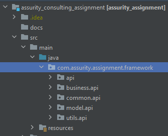
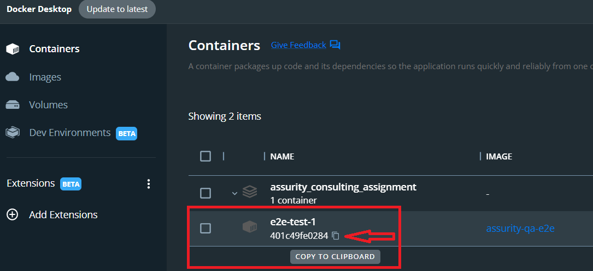

# Assurity Consulting Assignment
## Introduction
This repository contains the api test scenarios to test the api.tmsandbox.co.nz.
## Supported Operating Systems
* Windows
* Linux
* Mac  
## Folder Structure  
  
`com.assurity.assignment.framework` is the root package of the core components of the framework.
### api
This package contains the http client to perform api operations. There are multiple implementations using different tools and can be use a desired client based on the requirement.
### business
This package contains business function implementations for API. We use small functions in API utils as building blocks to build large business functions in business layer.
These functions will give more readability in test layer and also, decouple tech stack from test layer too.
### common
This package contains the common properties will be used across the api framework.
### model
This package contains model objects specific to API.
### utils
This package contains the utility classes.
## Prerequisites
Following dependencies should be installed before build and run the test suite.
* Java 11 or above
* Maven 3.8.x and above
## Check Java Installation
Run the command in a terminal
`java -version`. It should display the following output if you have installed java properly.  
`openjdk version "11" 2018-09-25`  
`OpenJDK Runtime Environment 18.9 (build 11+28)`  
`OpenJDK 64-Bit Server VM 18.9 (build 11+28, mixed mode)`
## Check Maven Installation
Run the command in terminal `mvn -v`. It should display the following output if you have installed maven properly.  
`Apache Maven 3.8.2 (ea98e05a04480131370aa0c110b8c54cf726c06f)`  
`Maven home: C:\Users\{@User Name}\Documents\Software\apache-maven-3.8.2` (The path can be different based on your installed location).  
`Java version: 11, vendor: Oracle Corporation, runtime: C:\Users\{@User Name}\Documents\Software\jdk-11` (The path can be different based on your installed location).  
`Default locale: en_US, platform encoding: Cp1252`  
`OS name: "windows 10", version: "10.0", arch: "amd64", family: "windows"`
## Configure Test Suite (Before Run)
Open the file `src/main/resources/framework_configs.properties`.  
Update the properties in the file as required.  
`http.request.timeout=` Set the api request timeout in seconds. Default value is 60s, if the property has been not configured. 
## Build and Run
### Build and Run in Docker
#### Build docker image
Run the command in terminal `docker build . -t assurity-qa-e2e` from the project root directory. (You must have docker installed locally).  
#### Start docker image
Run the command in terminal `docker-compose up -d`. This will start the docker image and execute all test cases.
#### Copy Test Artifacts From Docker Image to Local
* Copy the docker image id as shown in bellow image  
  
* Run this command in a terminal of your local machine.  
  `docker cp {@Docker Image Id}:/opt/assurity-qa-e2e/target C:\Users\{@User Name}\Downloads\assurity-api-test-artifacts`
* Go into the coppied folder (`C:\Users\{@User Name}\Downloads\assurity-api-test-artifacts`)
* View Test Results Report  
  _Open the file `assurity-api-test-artifacts/surefire-reports/index.html` in a web browser to view the HTML test results report._
* View Test Logs  
  _Open the file `assurity-api-test-artifacts/logs/assurity-e2e-api-test.log` to view the outputs logged to the file._
### Build and Run Locally

#### Build Test Suite
Run the command `mvn clean install -DskipTests` in a terminal from the project root directory to build the project.
#### Execute Testcases
##### Execute Full Suite
Run the command `mvn test` in a terminal from the project root directory.
##### Execute Given Test Suite
Run the command `mvn test -Dtest.suite=CategoryTests` in a terminal from the project root directory considering **CategoryTests** is the name of the test suite xml file in `src/test/resources` Ex: **CategoryTests.xml**.
##### View Test Results Report
Open the file `target/surefire-reports/index.html` in a web browser to view the HTML test results report.
##### View Test Logs
Open the file `target/logs/assurity-e2e-api-test.log` to view the outputs logged to the file.
